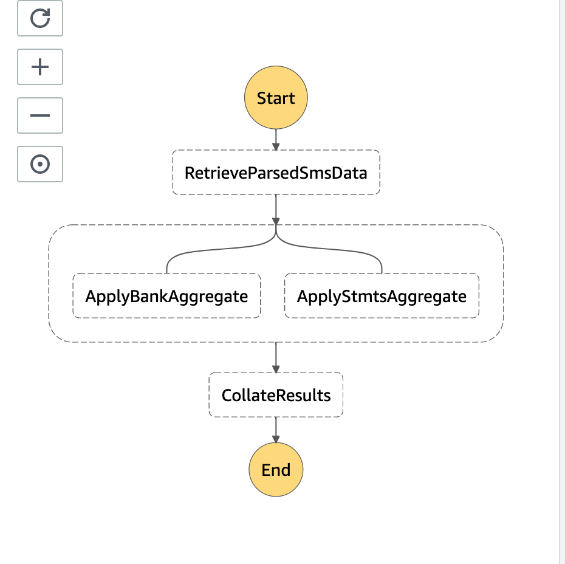

## AWS Step Function

### Example running parallel tasks

The AWS Step function invokes below Lambdas
* Lambda "get-smsdata-function" that prepares data for the next tasks
* Lambda "apply-bank-va-function" to apply variable aggregation on the data 
* Lambda "apply-statement-va-function" to apply variable aggregation on the data
* Lambda "save-aggregateddata-function" to save the aggregation in database

Currently the Step Function is invoked manually via AWS Console but can be invoked via another Lambda or on SNS Event.

The AWS Step Function uses "Parallel" state to invoke functions "apply-bank-va-function" and "apply-statement-va-function" parallely.

Each branch is self-contained. A state in one branch of a Parallel state must not have a Next field that targets a field outside of that branch, nor can any other state outside the branch transition into that branch.

Here is how the visual workflow looks.



#### Parallel State Input and Output Processing
A Parallel state provides each branch with a copy of its own input data.

We start with state "RetrieveParsedSmsData", which invokes Lambda "get-smsdata-function", which prepares data for applying variable aggregation.

The execution then invokes state "AggregateParallel". This state uses the data generated by Lambda "get-smsdata-function" `` "InputPath": "$.RetrieveParsedSmsData.Output", ``. 

The state AggregateParallel invokes two lambdas "apply-bank-va-function" and "apply-statement-va-function" parallely. The out put of each Lambda is stored in `` "ResultPath": "$.ApplyBankAggregate.Output", ``

The execution then invokes state CollateResults, which invokes Lambda save-aggregateddata-function. This Lambda received the output of state AggregateParallel as input. The output of state AggregateParallel is passed as `` Parameters ``
 

```
{
	"Comment": "Apply aggregate variable",
  	"StartAt": "RetrieveParsedSmsData",
  	"States": {
  		"RetrieveParsedSmsData": {
  			"Type": "Task",
  			"ResultPath": "$.RetrieveParsedSmsData.Output",
  			"Resource": "arn:aws:lambda:ap-south-1:376368920129:function:get-smsdata-function-1RGI4LZ5KXYUI",
  			"Next": "AggregateParallel"
  		},
    	"AggregateParallel": {
      		"Type": "Parallel",
      		"ResultPath": "$.CombinedOutput",
      		"InputPath": "$.RetrieveParsedSmsData.Output",
      		"OutputPath": "$",
      		"Next": "CollateResults",
      		"ResultSelector": {
      			"BankAggregateResult.$": "$[0].ApplyBankAggregate",
      			"StmtAggregateResult.$": "$[1].ApplyStmtsAggregate"
      		},
      		"Branches": [
        	{
	      		"StartAt": "ApplyBankAggregate",
	      		"States": {
	        		"ApplyBankAggregate": {
	          			"Type": "Task",
	          			"ResultPath": "$.ApplyBankAggregate.Output",
	          			"Resource": "arn:aws:lambda:ap-south-1:376368920129:function:apply-bank-va-fn-function-1BJEA0EMNHF6R",
	          			"Parameters": {
	        				"BankDetails": {
	            				"banksData.$": "$.parsedData.banksData"
	        				}
	    	  			},
	          			"End": true
	        		}
	      		}
        	},
        	{
          		"StartAt": "ApplyStmtsAggregate",
          		"States": {
            		"ApplyStmtsAggregate": {
              			"Type": "Task",
              			"ResultPath": "$.ApplyStmtsAggregate.Output",
              			"Resource": "arn:aws:lambda:ap-south-1:376368920129:function:apply-stmt-va-fn-function-9IJALZ76TI18",
              			"Parameters": {
            				"StmtDetails": {
                				"stmtsData.$": "$.parsedData.stmtsData"
            				}
            			},
              			"End": true
            		}
          		}
        	}
      		]
    	},
    	"CollateResults": {
			"Type": "Task",
        	"Resource": "arn:aws:lambda:ap-south-1:376368920129:function:saveagg-data-stack-function-1IJ3HTV2C2TU5",
        	"Parameters": {
          		"BankAggregate.$": "$.CombinedOutput.BankAggregateResult.Output",
          		"StmtAggregate.$": "$.CombinedOutput.StmtAggregateResult.Output"
        	},
        	"ResultPath": "$.CollateResults.Output",
        	"End": true
    	}
  	}
}
```

Below is the AWS Step Function execution output.

```
{
  "RetrieveParsedSmsData": {
    "Output": {
      "parsedData": {
        "banksData": [
          {
            "bankName": "SBI123",
            "transactionType": "Credit",
            "amount": 100
          },
          {
            "bankName": "ICICI123",
            "transactionType": "Debit",
            "amount": 200
          }
        ],
        "stmtsData": [
          {
            "statementId": "123123",
            "paymentDate": "Credit",
            "amount": 123
          },
          {
            "statementId": "123123",
            "paymentDate": "Debit",
            "amount": 123
          }
        ]
      }
    }
  },
  "CombinedOutput": {
    "BankAggregateResult": {
      "Output": {
        "aggregatedData": {
          "Debit": 100,
          "Credit": 123
        }
      }
    },
    "StmtAggregateResult": {
      "Output": {
        "aggrgatedPayments": "AggregatedPayments",
        "aggrgatedPaymentAmount": 123
      }
    }
  },
  "CollateResults": {
    "Output": {
      "message": "Data Saved"
    }
  }
}
```

